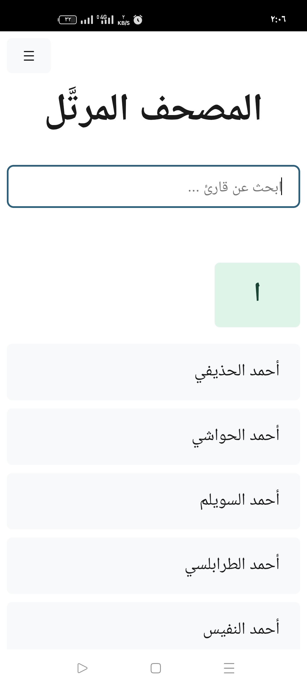
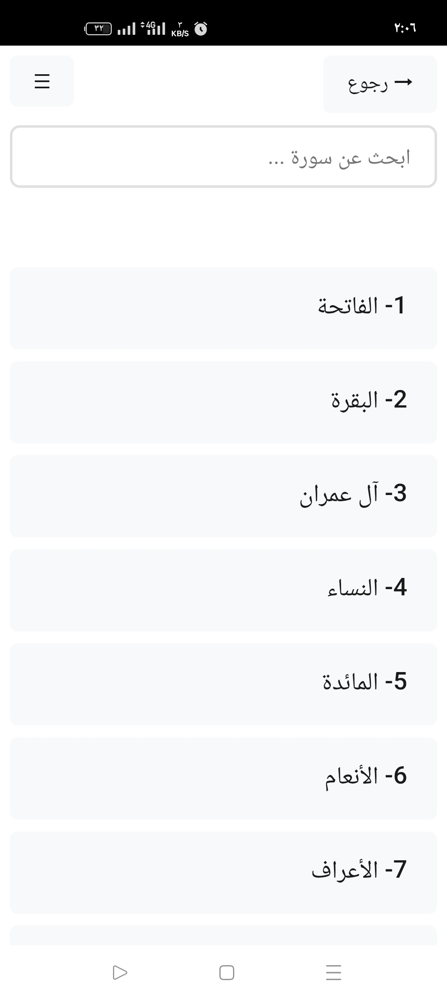

# 📖 المصحف المرتل

<div align="center">


**تطبيق لتشغيل القرآن الكريم بصوت أشهر القراء**

[المميزات](#-المميزات) • [التحميل](#-التحميل) • [الاستخدام](#-الاستخدام) • [التقنيات](#-التقنيات-المستخدمة)

</div>


## 📝 نظرة عامة

**المصحف المرتل** هو تطبيق مجاني مفتوح المصدر يوفر تجربة استماع سلسة للقرآن الكريم بأصوات نخبة من القراء المشهورين. التطبيق مصمم ليعمل على أجهزة Android و Windows، مع دعم التشغيل في الخلفية والتحكم من شاشة القفل.

### ✨ المميزات الرئيسية

- 🎙️ **مكتبة شاملة من القراء**: استمع للقرآن بصوت أشهر القراء مثل:
  - أحمد الحذيفي
  - محمد أيوب
  - الزين محمد أحمد
  - عبد الباسط عبد الصمد
  - محمود علي البنا
  - محمودخليل الحصري
  - والمزيد...

- 📱 **دعم متعدد المنصات**: 
  - Android (نسخة الجوال - تجريبية)
  - Windows (نسخة سطح المكتب)

- 🔊 **تشغيل متقدم**:
  - التشغيل في الخلفية
  - التحكم من شاشة القفل
  - عناصر التحكم من مركز الإشعارات

- 🔍 **تصفح سهل**:
  - البحث عن القراء
  - البحث عن السور

- 🌐 **جودة صوت عالية**: التسجيلات الصوتية من موقع mp3quran.net

- 🎨 **واجهة عربية أنيقة**: تصميم بسيط ومريح للعين

---

## 🚀 التحميل والتثبيت

### متطلبات التشغيل

#### Android
- نظام Android 7.0 (Nougat) أو أحدث
- مساحة تخزين 20 MB
- اتصال بالإنترنت (للبث المباشر)

#### Windows
- Windows 10 version 17763 أو أحدث
- اتصال بالإنترنت (للبث المباشر)

---

## 📖 الاستخدام

### الشاشة الرئيسية
1. عند فتح التطبيق، ستظهر لك قائمة بأشهر القراء
2. اضغط على القارئ المفضل لعرض قائمة السور

### تشغيل السور
1. اختر السورة التي تريد الاستماع إليها
2. سيبدأ التشغيل تلقائياً
3. يمكنك التحكم في التشغيل من:
   - شاشة القفل
   - مركز الإشعارات (Android)
   - مركز التحكم (Windows)

### البحث
- استخدم شريط البحث للعثور على قارئ معين
- يمكنك أيضاً البحث عن السور بالاسم

### عناصر التحكم
- ▶️ تشغيل / إيقاف مؤقت
- ⏭️ التالي
- ⏮️ السابق
- 🔊 التحكم في مستوى الصوت
- 🔄 وضع التكرار (قريباً)

---

## 🛠️ التقنيات المستخدمة

### Framework & Platform
- **.NET 9.0**: الإصدار الأحدث من إطار العمل
- **.NET MAUI**: للتطوير متعدد المنصات
- **Blazor Hybrid**: لبناء واجهة المستخدم بتقنيات الويب

### المكتبات والأدوات
```
CommunityToolkit.Maui.MediaElement v6.1.2

```

### مصادر البيانات
- **mp3quran.net**: للتسجيلات الصوتية عالية الجودة
- **mp3quran.net API**: قائمة القراء والسور الخاصة بكل قارئ وروابط الملفات
```
https://www.mp3quran.net/api/v3/reciters?language=ar
```

---

## 🎨 لقطات الشاشة

<div align="center">

| الشاشة الرئيسية | قائمة السور | المشغل |
|:---:|:---:|:---:|
|  |  |  |

</div>

---

## 🔧 التطوير

### البنية التحتية للكود

#### كائن السورة (Surah)
```csharp
public class Surah
{
    public int Index { get; set; } = 0;
    public string Name { get; set; } = string.Empty;
}
```

#### كائن القارئ (Reciter)
```csharp
public class Reciter
{
    public int Id { get; set; } = 0;
    public string Name { get; set; } = string.Empty;
    public string Server { get; set; } = string.Empty;
    public List<int> Surahs { get; set; } = new List<int>();
}
```
#### كائن البيانات (Data)
```csharp
public class Data
{
    public List<Surah> Sorahs { get; set; } = new();
    public List<Reciter> Reciters { get; set; } = new();
}
```

### التشغيل في الخلفية

يستخدم مكتبة CommunityToolkit.Maui.MediaElement للتشغيل الوسائط في الخلفية وفوق شاشة القفل لكل من **وندوز** و**أندرويد**

---

## 🤝 المساهمة

نرحب بمساهماتكم! إذا كنت ترغب في تحسين التطبيق:

1. Fork المشروع
2. أنشئ فرع جديد (`git checkout -b feature/amazing-feature`)
3. Commit التغييرات (`git commit -m 'إضافة ميزة رائعة'`)
4. Push إلى الفرع (`git push origin feature/amazing-feature`)
5. افتح Pull Request

### مجالات المساهمة المقترحة

- [ ] وضع التحميل للاستماع بدون إنترنت
- [ ] إضافة التفسير والترجمة
- [ ] تحسين واجهة المستخدم
- [ ] إضافة الوضع الليلي
- [ ] دعم لغات إضافية

---

## 📄 الترخيص

هذا المشروع مرخص تحت رخصة MIT - انظر ملف [LICENSE](LICENSE) للتفاصيل.

---

## 👥 الفريق

- **المطور**: يس سليمان

---

## 🙏 شكر وتقدير

- **mp3quran.net** - على توفير التسجيلات الصوتية عالية الجودة
- جميع القراء الكرام الذين منحونا شرف الاستماع لتلاواتهم
- مجتمع .NET MAUI على الدعم والموارد

---

## 📞 التواصل

- 📧 البريد الإلكتروني: admin@arbweb.org
- 🌐 الموقع: https://moratal.arbweb.org
- 💬 تواصل معنا من داخل التطبيق

---

## 🔄 التحديثات

### الإصدار 1.0.0 (نوفمبر 2025)
- ✅ إطلاق النسخة الأولى
- ✅ دعم Android و Windows
- ✅ التشغيل في الخلفية
- ✅ عناصر التحكم من شاشة القفل

### قادم قريباً
- 🔜 وضع التحميل
- 🔜 قوائم التشغيل المخصصة
- 🔜 الوضع الليلي
- 🔜 دعم iOS و macOS

---

<div align="center">

**صنع بـ ❤️ لخدمة كتاب الله**

[⬆ العودة للأعلى](#المصحف-المرتل-)

</div>